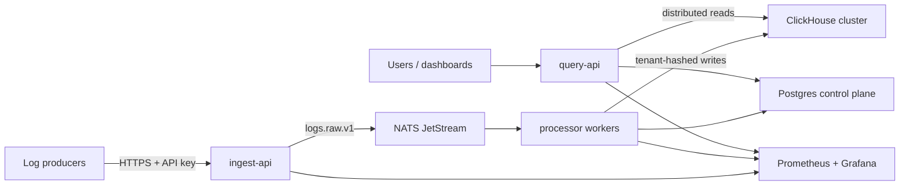

# Real-time Log Aggregator

A multi-tenant distributed log platform built to demonstrate production-oriented
system design: durable ingestion, asynchronous processing, replay safety,
tenant-aware ClickHouse sharding, analytical queries, alert state management,
backpressure, and observability.

## Architecture at a glance



The runtime is split into three stateless Go services:

- `ingest-api` authenticates and validates batches, then durably publishes them.
- `processor` normalizes logs, writes to ClickHouse, evaluates alerts, and manages retries.
- `query-api` authenticates reads and coordinates tenant-scoped distributed queries.

NATS JetStream is the buffering and replay boundary, ClickHouse is the sharded
analytical data plane, and Postgres owns control-plane and alert state.

## Design highlights

- At-least-once processing with deterministic batch IDs and replay-safe writes
- Backpressure based on durable consumer lag
- Daily ClickHouse partitions and `cityHash64(tenant_id)` shard routing
- Distributed query fan-out, aggregate merging, and explicit partial-result metadata
- Tenant isolation derived from API keys rather than client-supplied identifiers
- Dead-letter handling for poison messages and exhausted retries
- Prometheus metrics and pre-provisioned Grafana dashboards
- Time-, sequence-, and full-stream replay modes

## Repository map

```text
cmd/                    service and utility entrypoints
internal/ingest/        HTTP ingestion, authorization, limits, backpressure
internal/stream/        JetStream publishing, consumption, replay, and DLQ
internal/processor/     normalization, persistence, alert pipeline
internal/queryapi/      authenticated raw and analytical queries
internal/alerts/        rule evaluation, state transitions, notifications
db/                     Postgres and ClickHouse schemas/migrations
deployments/local/      Compose topology, Prometheus, Grafana, ClickHouse config
docs/                   architecture, contracts, operations, and storage design
```

## Quick start

Prerequisites: Go, Docker, and Docker Compose.

```bash
docker compose -f deployments/local/docker-compose.yml up -d
go run ./cmd/postgres-migrate
cat db/clickhouse/001_logs.sql | docker compose -f deployments/local/docker-compose.yml exec -T clickhouse clickhouse-client --multiquery
cat db/clickhouse/003_distributed_logs.sql | docker compose -f deployments/local/docker-compose.yml exec -T clickhouse clickhouse-client --multiquery
go run ./cmd/nats-setup
```

After seeding a tenant and API key, run these in separate terminals:

```bash
go run ./cmd/ingest-api
go run ./cmd/processor
go run ./cmd/query-api
```

The complete bootstrap procedure—including API-key seeding, migrations,
configuration, health checks, load testing, and failure exercises—is in
[docs/operations.md](docs/operations.md).

## Verification

```bash
make ci
```

Individual targets are available for formatting, unit tests, builds, and the
end-to-end ingest/queue/processor integration test.

## Documentation

- [Architecture and design](docs/architecture.md) — HLD, LLD, data flows, guarantees, scaling, and tradeoffs
- [Operations guide](docs/operations.md) — local setup, configuration, migrations, load testing, and runbooks
- [HTTP API](docs/api.md) — endpoint contracts and validation
- [JetStream contract](docs/jetstream.md) — subjects, schemas, replay, and DLQ behavior
- [Distributed ClickHouse](docs/distributed-clickhouse.md) — sharding, coordinator behavior, migration, and production topology

## Current engineering boundaries

The local environment demonstrates logical sharding, not full high
availability. Production deployment needs replicas per ClickHouse shard, a
three-node Keeper quorum, distributed rate limiting, and external notification
sinks. These are explicit evolution points rather than hidden assumptions.
