# Real-time Log Aggregator Architecture

This document is the architectural source of truth for the implemented system.
It covers the high-level design (HLD), low-level design (LLD), data model,
distributed-system behavior, guarantees, failure modes, and evolution path.

## 1. Problem statement

The platform accepts multi-tenant application logs, absorbs bursty write load,
normalizes and stores records for analytical access, evaluates alert rules, and
supports replay without multiplying persisted data or alert transitions.

The design optimizes for:

- durable acceptance independent of analytical-storage latency
- horizontal scaling of stateless services
- tenant isolation throughout ingestion, storage, and querying
- bounded and observable failure recovery
- efficient time-range and tenant-scoped analytical queries
- explicit delivery semantics rather than an unrealistic exactly-once claim

The current local deployment demonstrates logical sharding. It is not a
production HA topology because shards and Keeper are not replicated.

## 2. Requirements and constraints

### Functional requirements

- Authenticate producers and readers with API keys.
- Accept bounded batches of structured logs over HTTP.
- Preserve accepted batches in a durable replayable stream.
- Normalize timestamps, tags, trace IDs, hosts, fields, and fingerprints.
- Query raw logs and time-bucketed/grouped analytics.
- Evaluate threshold and pattern rules and persist alert lifecycle state.
- Retry transient failures and isolate poison messages in a DLQ.
- Expose health, readiness, metrics, and partial-result status.

### Non-functional requirements

| Quality | Design response |
|---|---|
| Availability | Stateless APIs, durable queue, best-effort reads, retrying writes |
| Scalability | Queue-based worker scaling and tenant-hashed ClickHouse shards |
| Durability | JetStream persistence, Postgres volumes, ClickHouse shard volumes |
| Consistency | At-least-once delivery plus application-level batch idempotency |
| Isolation | Tenant identity derived from API keys and enforced in every read/write |
| Operability | Readiness dependency checks, Prometheus metrics, Grafana dashboards |
| Evolvability | Versioned events, explicit interfaces, separate control/data planes |

### Explicit constraints

- Alert evaluation currently runs inline with processing.
- Rate limiting is process-local and therefore approximate across replicas.
- Idempotency is batch-scoped using `ingest_id`, not record-scoped.
- The local ClickHouse cluster has two shards with one replica each.

## 3. High-level design

### 3.1 System context

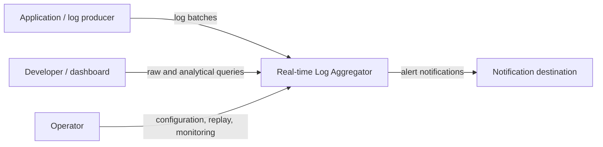

### 3.2 Container view

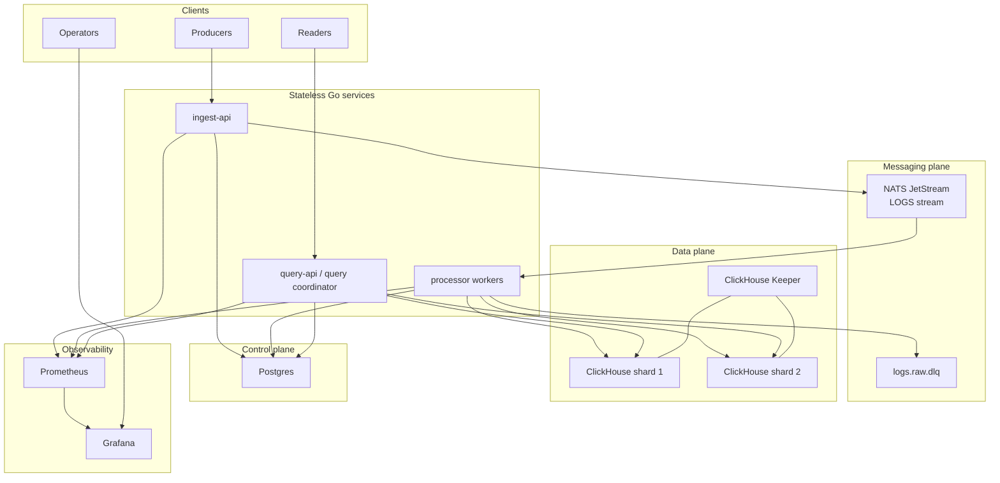

### 3.3 Control plane versus data plane

| Plane | Technology | Owns |
|---|---|---|
| Ingest transport | NATS JetStream | Durable batches, replay position, redelivery |
| Analytical data | ClickHouse | Normalized logs and aggregate execution |
| Control/state | Postgres | Tenants, keys, services, rules, alerts, deliveries |
| Coordination | ClickHouse Keeper | Cluster metadata and distributed DDL coordination |

The separation prevents high-volume immutable log data from competing with
transactional alert state and keeps stream retention independent of query-store
retention.

## 4. Core data flows

### 4.1 Ingestion sequence

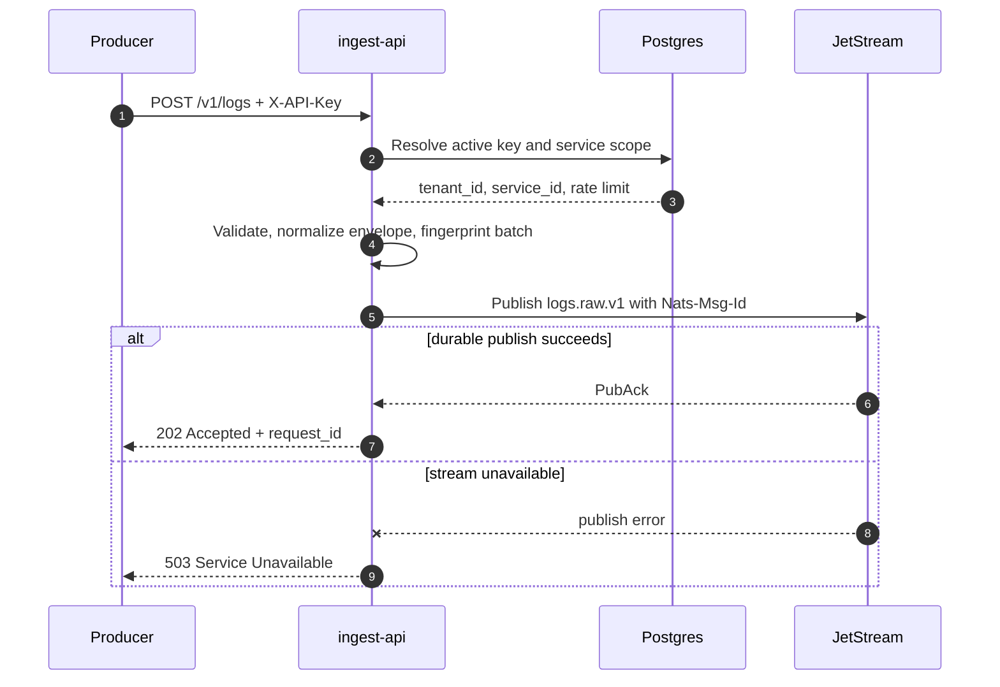

Acceptance means the stream durably acknowledged the event; it does not mean
ClickHouse persistence or alert evaluation has completed.

### 4.2 Processing and retry sequence

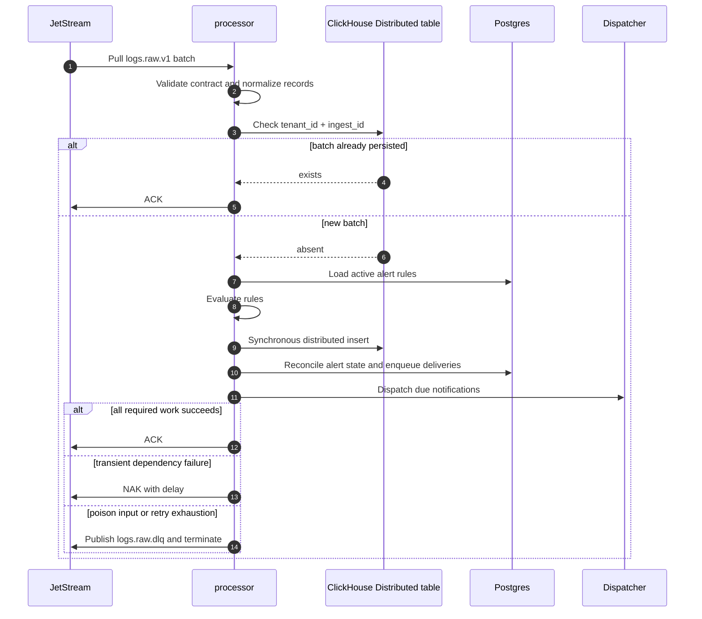

Writes use `insert_distributed_sync=1`; an unavailable target shard therefore
fails the batch and lets JetStream drive recovery instead of acknowledging data
that only exists in a local distribution queue.

### 4.3 Distributed query sequence

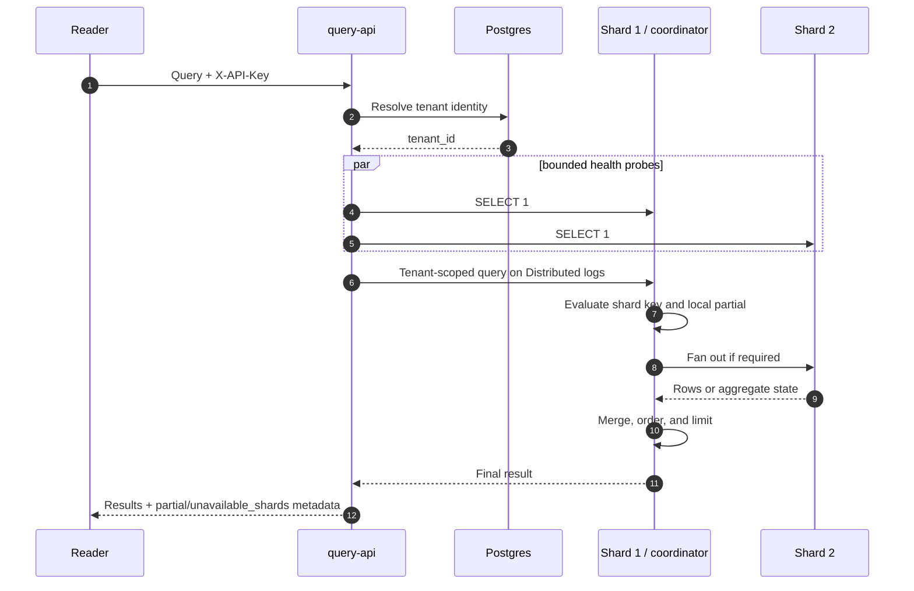

Every query includes the authenticated `tenant_id`. Because the distributed
table shards by `cityHash64(tenant_id)`, `optimize_skip_unused_shards=1` normally
reduces a tenant query to one shard. ClickHouse—not application code—performs
fan-out and aggregation-state merging.

## 5. Distributed storage design

### 5.1 Logical and physical layout

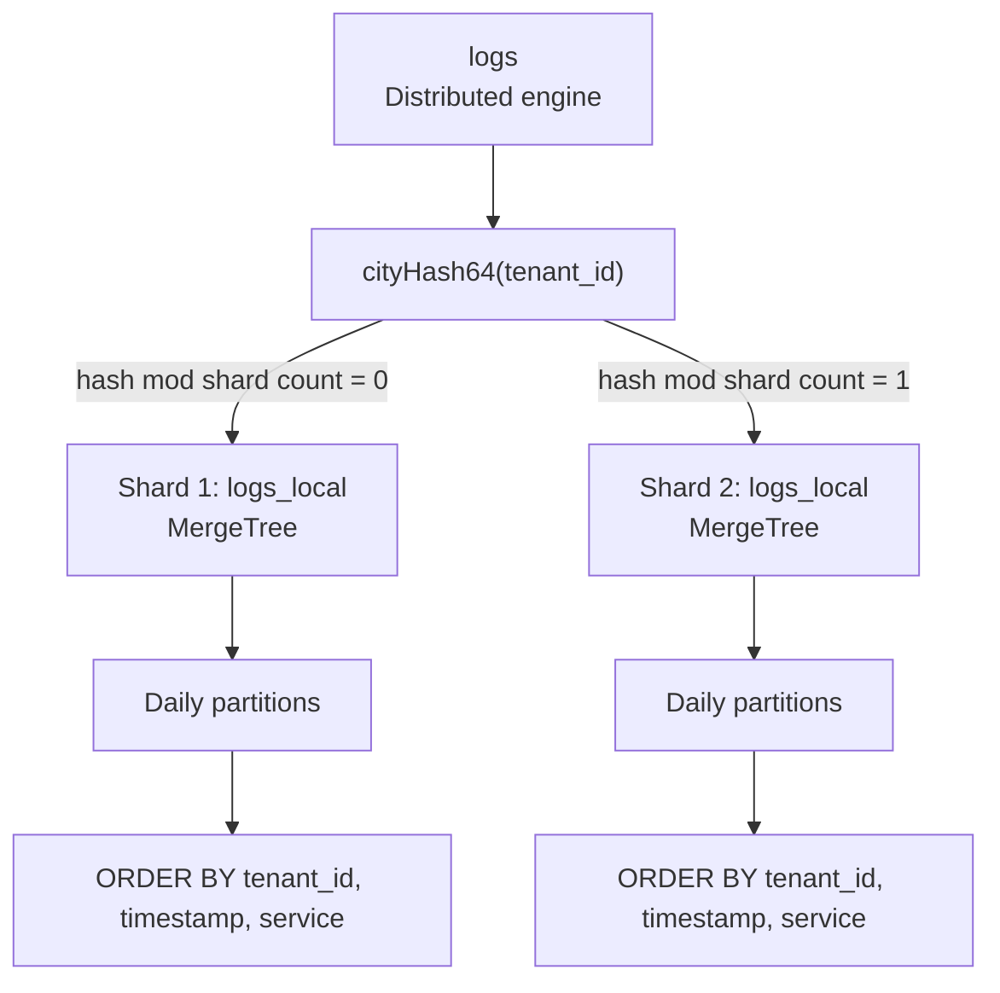

The three independent layout decisions serve different purposes:

| Mechanism | Key | Purpose |
|---|---|---|
| Sharding | `cityHash64(tenant_id)` | Distribute tenants and route reads/writes |
| Partitioning | `toDate(timestamp)` | TTL cleanup and partition pruning |
| Sorting | `(tenant_id, timestamp, service)` | Tenant/time range locality |

Compression uses Delta codecs for numeric/time columns, LowCardinality for
bounded tag dimensions, and ZSTD for variable strings. Bloom filters accelerate
ingest-ID, trace-ID, and extracted error-code lookups where the primary sort key
cannot.

### 5.2 Query coordination and partial failure

The `query-api` is the external coordinator, while ClickHouse's `Distributed`
engine is the execution coordinator. Reads set:

- `optimize_skip_unused_shards=1`
- `skip_unavailable_shards=1`

The API probes configured shard HTTP endpoints with a one-second budget. If a
shard is unavailable, JSON responses expose `partial=true` and
`unavailable_shards`; streaming responses expose equivalent headers. This is a
conservative completeness signal: an unavailable shard may not contain the
authenticated tenant, but the API never labels uncertain data as complete.

Writes deliberately do not degrade to partial success.

### 5.3 Production deployment target

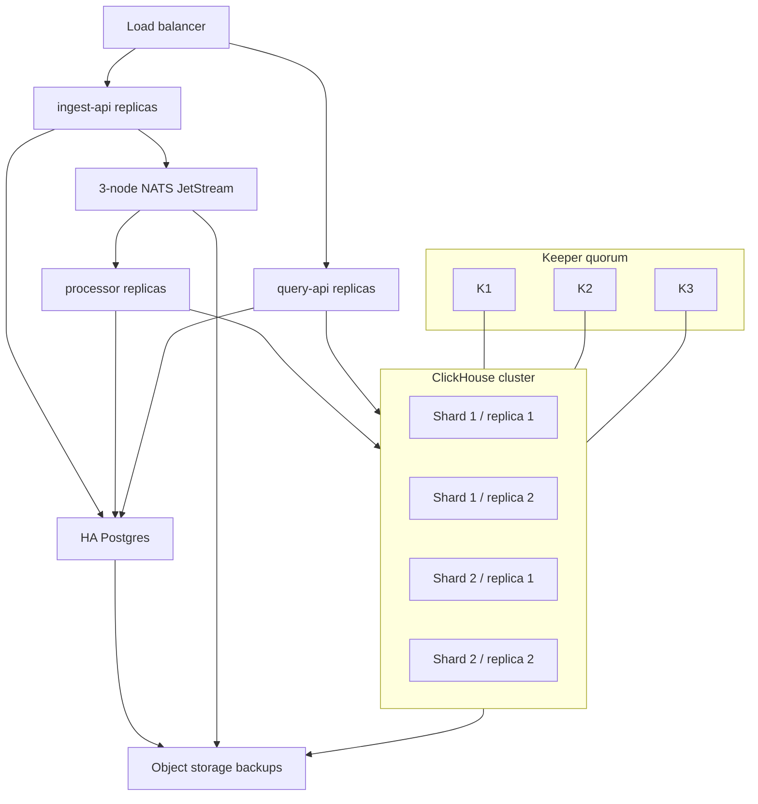

Persistent storage is required for JetStream, Postgres, ClickHouse replicas,
and Keeper. Compute may be disposable if these stateful layers use durable
volumes and tested backups.

## 6. Low-level design

### 6.1 Service component view

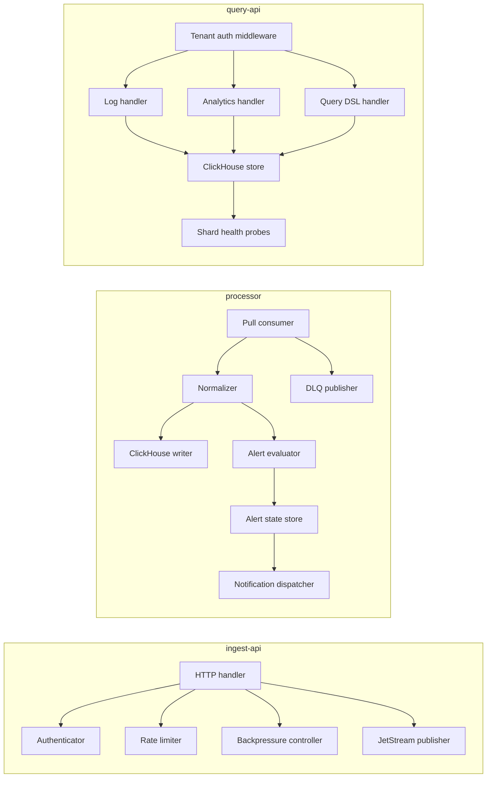

Interfaces isolate transport and persistence concerns, allowing handler and
pipeline tests to use deterministic stubs without starting infrastructure.

### 6.2 Package responsibilities

| Package | Responsibility |
|---|---|
| `internal/ingest` | Validation, authorization contract, limits, rate limiting, backpressure |
| `internal/stream` | JetStream publish/consume, replay modes, lag monitoring, DLQ |
| `internal/processor` | Contract validation, normalization, idempotency, persistence pipeline |
| `internal/queryapi` | Tenant context, filters, SQL generation, response streaming |
| `internal/alerts` | Rule evaluation, state transitions, notification retry state |
| `internal/readiness` | Dependency-specific readiness aggregation |
| `internal/metrics` | Prometheus formatting and HTTP instrumentation |
| `internal/config` | Environment-driven runtime configuration |

### 6.3 Postgres domain model

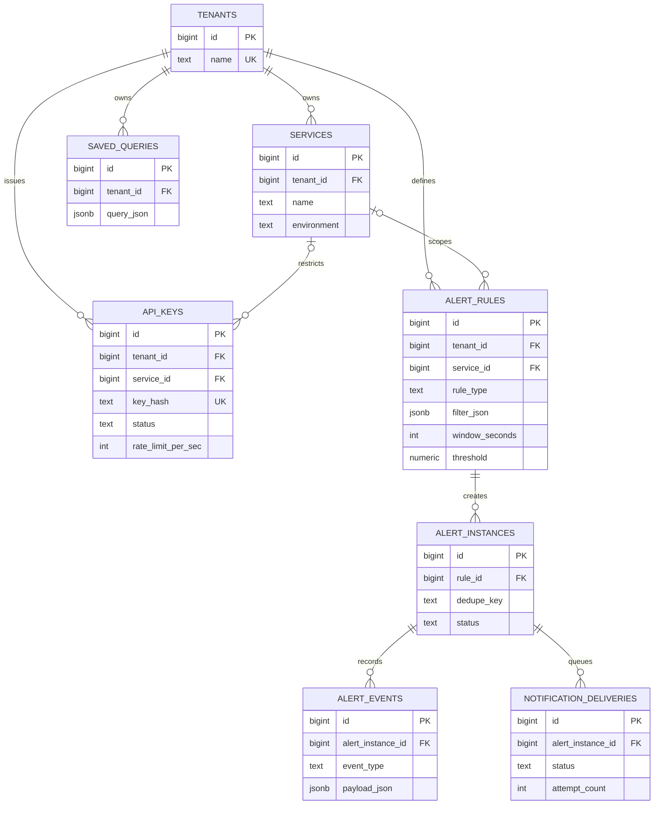

### 6.4 Alert lifecycle

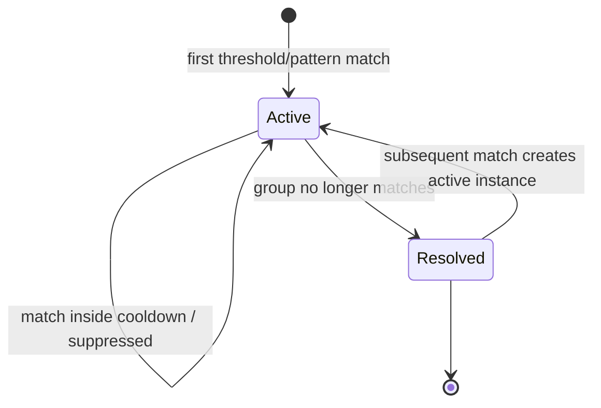

The dedupe key is derived from rule scope and configured grouping fields. Alert
events are append-oriented, while the instance row represents current state.

## 7. Contracts and delivery semantics

### 7.1 Versioned boundaries

- HTTP ingestion requires `logs.ingest.v1`.
- JetStream transport uses `logs.raw.v1`.
- DLQ envelopes use `logs.dlq.v1`.

Schema versions make incompatible changes explicit and prevent silent producer/
consumer drift.

### 7.2 At-least-once, not exactly-once

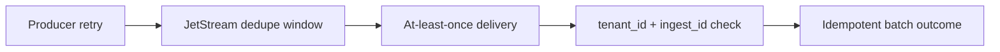

- The deterministic batch fingerprint is sent as `Nats-Msg-Id` for stream-side
  duplicate suppression within `NATS_DEDUPE_WINDOW`.
- JetStream may redeliver after timeouts or negative acknowledgements.
- The processor checks `(tenant_id, ingest_id)` before persistence.
- A crash between ClickHouse persistence and acknowledgement causes redelivery;
  the existence check then suppresses the duplicate batch.

There is still a distributed transaction boundary between ClickHouse and
Postgres alert state. The current ordering favors not acknowledging before log
persistence and state reconciliation complete, but it is not atomic across both
databases. A production evolution could use a dedicated processed-batch ledger
or transactional outbox pattern.

## 8. Failure model

| Failure | Observable behavior | Recovery |
|---|---|---|
| Invalid/missing API key | `401`/`403` | Correct credentials or scope |
| Ingest overload | Delay or `429` | Backpressure plus worker scaling |
| JetStream publish failure | `503`; batch not accepted | Producer retry |
| Poison event | Published to `logs.raw.dlq` | Inspect, correct, replay |
| Transient processor dependency failure | NAK and redelivery | Automatic bounded retry |
| Retry exhaustion | DLQ and terminate | Operator remediation |
| Target ClickHouse shard unavailable on write | Insert fails; message not ACKed | Shard recovery, then redelivery |
| Non-coordinator shard unavailable on read | `200` with partial metadata | Retry or accept degraded result |
| Coordinator unavailable | `503` | Fail over coordinator endpoint |
| Postgres unavailable | Auth/alert/readiness failure | Database recovery/failover |

## 9. Backpressure and scaling

JetStream absorbs short mismatches between producer rate and processing rate.
Let:

- `λ` = incoming logs/second
- `μ` = sustainable processed logs/second per worker
- `n` = active workers

Backlog grows when `λ > nμ`. Approximate drain time after load returns below
capacity is:

```text
drain_time ≈ backlog / (nμ - λ)
```

`logagg_queue_consumer_pending` is therefore the primary scaling signal; CPU is
supporting evidence. Scale out when lag remains elevated and dependencies are
healthy. Scale in only after lag remains near zero to avoid oscillation.

| Component | Horizontal strategy | Current limiter |
|---|---|---|
| `ingest-api` | Add stateless replicas behind a load balancer | Process-local rate limiter |
| `processor` | Add pull-consumer workers | Downstream write rate and alert contention |
| `query-api` | Add stateless replicas | ClickHouse query capacity |
| ClickHouse | Add tenant-hashed shards and replicas | Rebalancing existing tenants |

Adding shards changes hash placement. Production expansion therefore requires a
planned rebalancing strategy—such as weighted shards, explicit tenant placement,
or migration into a new distributed table—not an uncoordinated config edit.

## 10. Security and tenant isolation

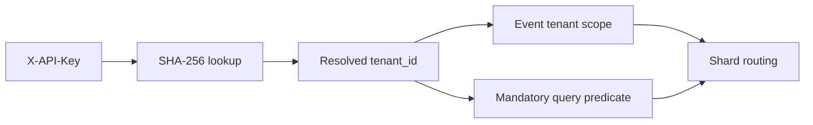

- Plaintext API keys are not stored; Postgres stores their SHA-256 digests.
- Ingestion validates service/environment scope against control-plane records.
- Readers cannot submit or override `tenant_id`.
- Tenant identity is carried in the request context and required by ClickHouse
  store methods, which fail closed if it is absent.
- Parameter values are validated and SQL literals are escaped before query
  generation.

Future hardening includes secret rotation, TLS/mTLS, audit logging, distributed
rate limits, and service/environment authorization on the read path.

## 11. Observability model

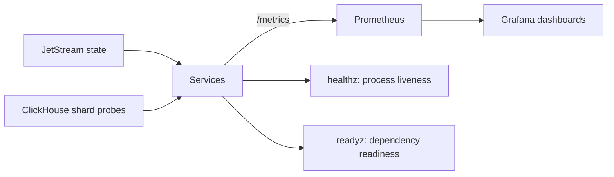

The telemetry model follows the pipeline:

- edge: request rate, latency, status, authentication and validation outcomes
- queue: stream size, pending messages, acknowledgements, redeliveries
- worker: processed batches/logs, failures, processing duration
- domain: alert transitions by event type and status
- storage: readiness and per-request shard completeness

See [operations.md](./operations.md) for concrete metrics and failure drills.

## 12. Key design decisions and tradeoffs

| Decision | Why | Cost |
|---|---|---|
| JetStream between ingest and processing | Durable burst absorption and replay | Eventual visibility and operational queue management |
| ClickHouse for logs | Compression and analytical scans | Poor fit for transactional state |
| Postgres for control plane | Constraints, transactions, relational ownership | Cross-store consistency boundary |
| Tenant hash sharding | Stable tenant locality and shard pruning | Hot-tenant risk and rebalancing complexity |
| ClickHouse `Distributed` coordinator | Native fan-out and aggregate merging | Coordinator dependency and ClickHouse-specific behavior |
| Synchronous distributed inserts | Prevent acknowledged-but-not-remote writes | Higher write latency and lower availability during shard failure |
| Best-effort reads | Preserve diagnostic access during partial outage | Results can be incomplete and must be labeled |
| Inline alert evaluation | Simple, low-latency pipeline | Couples alert throughput to ingestion processing |

## 13. Evolution roadmap

1. Add replicated ClickHouse shards and a three-node Keeper quorum.
2. Introduce explicit tenant placement or consistent-hash virtual nodes before
   online shard expansion.
3. Replace process-local rate limiting with a distributed token bucket.
4. Move notifications behind a transactional outbox and dedicated workers.
5. Add a processed-batch ledger to tighten cross-store replay semantics.
6. Add service/environment authorization and audit events to read APIs.
7. Add archive/restore workflows once retention and cold-storage requirements
   are finalized.

## 14. Source map

- Service entrypoints: `cmd/ingest-api`, `cmd/processor`, `cmd/query-api`
- Ingestion pipeline: `internal/ingest`
- Stream and replay logic: `internal/stream`
- Processing pipeline: `internal/processor`
- Query coordination: `internal/queryapi`
- Alert domain: `internal/alerts`
- Postgres schema: `db/postgres/001_init.sql`
- ClickHouse schemas: `db/clickhouse/*.sql`
- Local topology: `deployments/local/docker-compose.yml`

Related references:

- [HTTP API](./api.md)
- [JetStream contract](./jetstream.md)
- [Distributed ClickHouse](./distributed-clickhouse.md)
- [Operations guide](./operations.md)
